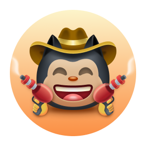
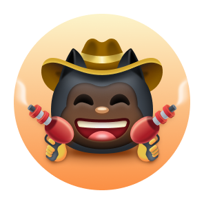

<!-- 
 -->

# 🏆 Logros de GitHub 🏆

 

  

 

# 🏅 Mostrando Logros 🏅

#### Mostrar logros en tu perfil es completamente opcional; por defecto, pueden ser vistos por cualquier persona que vea tu perfil público.

#### Puedes optar por no mostrar logros en tu perfil yendo a tus [ajustes de perfil](https://github.com/settings).

# 📃 Lista de Logros 📃
 

| Insignia |                     Nombre                      |                                                                                                       ¿Cómo obtenerla?                                                                                                        |                                                                                                                                                                                                                                                                                                                                                             Cantidad necesaria                                                                                                                                                                                                                                                                                                                                                              | 
| :-: |:-----------------------------------------------:|:-----------------------------------------------------------------------------------------------------------------------------------------------------------------------------------------------------------------------------:|:-------------------------------------------------------------------------------------------------------------------------------------------------------------------------------------------------------------------------------------------------------------------------------------------------------------------------------------------------------------------------------------------------------------------------------------------------------------------------------------------------------------------------------------------------------------------------------------------------------------------------------------------------------------------------------------------------------------------------------------------:|
|  | Corazón en la Manga   (Heart On Your Sleeve) |                                                                                   🔜 Reacciona a algo en GitHub con un emoji ❤️ (En prueba)                                                                                   | <table>  <thead>  <tr>  <th>POR DEFECTO</th> <th>BRONCE</th>  <th>PLATA</th>  <th>ORO</th>  </tr>  </thead>  <tbody>  <tr>  <td align="center"></td>   <td></td>  <td></td>  <td></td>  </tr>  <tr>  <td align="center">(?)</td>  <td align="center">(?)</td>  <td align="center">(?)</td>  <td align="center">(?)</td>  </tr>   </tbody>  </table> |
|  |        Fuente abierta   (Open Sourcerer)         |                                                                       🔜 El usuario tiene PRs combinados en múltiples repositorios públicos (En prueba)                                                                       |                      <table>  <thead>  <tr>  <th>POR DEFECTO</th> <th>BRONCE</th>  <th>PLATA</th>  <th>ORO</th>  </tr>  </thead>  <tbody>  <tr>  <td align="center"></td>   <td></td>  <td></td>  <td></td>  </tr>  <tr>  <td align="center">(?)</td>  <td align="center">(?)</td>  <td align="center">(?)</td>  <td align="center">(?)</td>  </tr>   </tbody>  </table>                      |
|                  |                   Starstruck                    |                                                                                        Crea un repositorio y obtén 16 estrellas o más                                                                                         |                       <table>  <thead>  <tr>  <th>POR DEFECTO</th> <th>BRONCE</th>  <th>PLATA</th>  <th>ORO</th>  </tr>  </thead>  <tbody>  <tr>  <td align="center"></td>   <td></td>  <td></td>  <td></td>  </tr>  <tr>  <td align="center">16</td>  <td align="center">128</td>  <td align="center">512</td>  <td align="center">4096</td>  </tr>   </tbody>  </table>                        |
|                  |                    Quickdraw                    |                                                                  Cierra una incidencia o una pull request dentro de los 5 minutos posteriores a la apertura                                                                   |                                                                                                                                                                                                                                              <table>  <thead>  <tr>  <th>POR DEFECTO</th>  </tr>  </thead>  <tbody>  <tr>  <td></td> </tr>  <tr>  <td align="center">1</td> </tr>   </tbody>  </table>                                                                                                                                                                                                                                              |
|      |               Pair Extraordinaire               |    [Co-Autoría](https://docs.github.com/pull-requests/committing-changes-to-your-project/creating-and-editing-commits/creating-a-commit-with-multiple-authors) Sé coautor en una pull request de dos o más contribuyentes     |    <table>  <thead>  <tr>  <th>POR DEFECTO</th> <th>BRONCE</th>  <th>PLATA</th>  <th>ORO</th>  </tr>  </thead>  <tbody>  <tr>  <td align="center"></td>   <td></td>  <td></td>  <td></td>  </tr>  <tr>  <td align="center">1</td>  <td align="center">10</td>  <td align="center">24</td>  <td align="center">48</td>  </tr>   </tbody>  </table>     |
|      |                   Pull Shark                    |                                                                                                 Fusiona 2 pull requests o más                                                                                                 |                                       <table>  <thead>  <tr>  <th>POR DEFECTO</th> <th>BRONCE</th>  <th>PLATA</th>  <th>ORO</th>  </tr>  </thead>  <tbody>  <tr>  <td align="center"></td>   <td></td>  <td></td>  <td></td>  </tr>  <tr>  <td align="center">1</td>  <td align="center">16</td>  <td align="center">128</td>  <td align="center">1024</td>  </tr>   </tbody>  </table>                                       |
|  |                  Galaxy Brain                   |                                                                                             Obtiene 2 respuestas aceptadas o más                                                                                              |                                         <table>  <thead>  <tr>  <th>POR DEFECTO</th> <th>BRONCE</th>  <th>PLATA</th>  <th>ORO</th>  </tr>  </thead>  <tbody>  <tr>  <td></td>  <td></td>  <td></td>  <td></td>  </tr>  <tr>  <td align="center">2</td> <td align="center">8</td>  <td align="center">16</td>  <td align="center">32</td>  </tr>   </tbody>  </table>                                          
|                  |                      YOLO                       |                                                                                   Fusiona al menos una pull request sin revisión de código                                                                                    |                                                                                                                                                                                                                                                           <table>  <thead>  <tr>  <th>POR DEFECTO</th>  </tr>  </thead>  <tbody>  <tr>  <td></td> </tr>  <tr>  <td align="center">1</td> </tr>   </tbody>  </table>                                                                                                                                                                                                                                                           |
|                  |              Patrocinador Público               |                                                              Patrocina repositorios de código abierto a través de [GitHub Sponsors](https://github.com/sponsors)                                                              |                                                                                                                                                                                                                                                  <table>  <thead>  <tr>  <th>POR DEFECTO</th>  </tr>  </thead>  <tbody>  <tr>  <td></td> </tr>  <tr>  <td align="center">1</td> </tr>   </tbody>  </table>                                                                                                                                                                                                                                                  |

# 👋 Tono de Piel del Logro 👋

#### La apariencia de algunos logros depende de tu Preferencia de Tono de Piel de Emoji.

#### Puedes cambiar tu Tono de Piel preferido yendo a [ajustes de apariencia](https://github.com/settings/appearance).

 

| Insignia  |   Nombre   | Versiones de Tono de Piel | 
|:--------------------------------------------------------------------------------:|:----------:| :-: |
|  | Starstruck | <table>  <thead>  <tr>  <th>👋</th> <th>👋🏻</th>  <th>👋🏼</th>  <th>👋🏽</th>  <th>👋🏾</th>  <th>👋🏿</th>  </tr>  </thead>  <tbody>  <tr>  <td align="center"></td>   <td align="center"></td>  <td align="center"></td>  <td align="center"></td>  <td align="center"></td>   <td align="center"></td>   </tr>   <tr>  <td align="center">👋</td> <td align="center">👋🏻</td>  <td align="center">👋🏼</td>  <td align="center">👋🏽</td>  <td align="center">👋🏾</td>  <td align="center">👋🏿</td>  </tr>  </tbody>  </table>      |
|     | Quickdraw  | <table>  <thead>  <tr>  <th>👋</th> <th>👋🏻</th>  <th>👋🏼</th>  <th>👋🏽</th>  <th>👋🏾</th>  <th>👋🏿</th>  </tr>  </thead>  <tbody>  <tr>  <td align="center"></td>   <td align="center"></td>  <td align="center"></td>  <td align="center"></td>  <td align="center"></td>   <td align="center"></td>   </tr>   <tr>  <td align="center">👋</td> <td align="center">👋🏻</td>  <td align="center">👋🏼</td>  <td align="center">👋🏽</td>  <td align="center">👋🏾</td>  <td align="center">👋🏿</td>  </tr>  </tbody>  </table>      |

# ✨ Insignias Destacadas ✨
 

|                                                                                                                                            Insignia                                                                                                                                            |           Nombre           |                                                         ¿Cómo obtenerla?                                                          |
|:----------------------------------------------------------------------------------------------------------------------------------------------------------------------------------------------------------------------------------------------------------------------------------------------:|:--------------------------:|:---------------------------------------------------------------------------------------------------------------------------------:|
|                                                                                                               |            Pro             |            Usa [GitHub Pro](https://docs.github.com/en/get-started/learning-about-github/githubs-products#github-pro)             |
|                 |  Miembro del Programa para Desarrolladores  | Sé un miembro registrado del [Programa para Desarrolladores de GitHub](https://docs.github.com/en/developers/overview/github-developer-program) |
|  | Cazador de Recompensas por Errores de Seguridad | Ayudó a rastrear vulnerabilidades de seguridad en [GitHub Security](https://bounty.github.com/) |
|  | Experto en el Campus de GitHub | Participa en el [Programa del Campus de GitHub](https://education.github.com/experts) |
|  | Crédito por Avisos de Seguridad | Ten tu aviso de seguridad enviado a la [Base de Datos de Avisos de GitHub](https://github.com/advisories) aceptado |

# ❌ Insignias ya no disponibles ❌
 

| Insignia |              Nombre              | ¿Cómo obtenerla? | Cantidad necesaria | 
| :-: |:--------------------------------:| :-: | :-: |
|      |    Contribuidor marciano 2020    | Contribuyó con código a un repositorio utilizado en la [Misión del Helicóptero Marte 2020](https://github.com/readme/featured/nasa-ingenuity-helicopter) | <table>  <thead>  <tr>  <th>POR DEFECTO</th>  </tr>  </thead>  <tbody>  <tr>  <td></td> </tr>  <tr>  <td align="center">1</td> </tr>   </tbody>  </table> |
|  | Colaborador de Código del Ártico | Contribuyó con código a un repositorio en el [Programa de Archivo GitHub 2020](https://archiveprogram.github.com/) | <table>  <thead>  <tr>  <th>POR DEFECTO</th>  </tr>  </thead>  <tbody>  <tr>  <td></td> </tr>  <tr>  <td align="center">1</td> </tr>   </tbody>  </table> |

# ℹ️ Más información ℹ️

#### Puedes encontrar más información sobre las insignias de GitHub en este [enlace](https://docs.github.com/en/account-and-profile/setting-up-and-managing-your-github-profile/customizing-your-profile/personalizing-your-profile#displaying-badges-on-your-profile).

## Referencias

<ul>
<li>

Tomado de este repositorio [github](https://github.com/drknzz/GitHub-Achievements/tree/main)
</li>
<li>

También teniendo de referencia este [repositorio](https://github.com/Schweinepriester/github-profile-achievements)
</li>
</ul>
